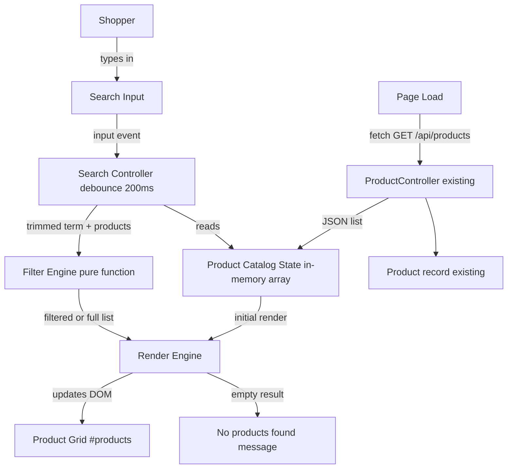

# Architecture: Product Search by Name

## Source
- Requirements: `src/docs/requirements.md` (Jira EPMCDMETST-62766)
- Scope: Client-side, prefix-based, case-insensitive product name search with debounced filtering of the already-loaded product catalog. No backend changes.

## 1. Requirements Summary (Architecture-Relevant)

Functional:
- Add a search `<input>` above the product grid (FR1, FR10).
- Debounce input by 200ms (FR8), trim whitespace (FR6), require a 2+ character threshold (FR4), then filter the in-memory `products` array by case-insensitive "starts with" match on `name` (FR2, FR3, FR7 for no-results messaging, FR9 for clearing).
- Below threshold or empty input, render the full, unfiltered list (FR5).

Non-Functional:
- NFR2 (Client-only): zero new endpoints, zero new network calls — search operates purely on the `products` array already fetched by the existing `fetch('/api/products')` call.
- NFR3 (Maintainability): implemented in plain HTML/CSS/JS, consistent with the existing single-file `index.html` pattern; no framework/build tool introduced.
- NFR4 (Testability): filtering logic (trim -> threshold check -> case-insensitive prefix match -> empty/no-results handling) must be a pure, isolable function so it can be unit tested independent of the DOM.
- NFR5 (Compatibility): existing REST contract (`GET /api/products`), initial render, cart, and checkout behavior must remain unchanged.

Key architectural implication: this is a **pure frontend, in-browser data-transformation feature** layered onto the existing static page. The backend (`ProductController`, `Product` model) is untouched and out of scope.

## 2. Architecture Analysis

- **Application type**: Server-rendered static page (Spring Boot serving `src/main/resources/static/index.html`) with vanilla JS driving all dynamic behavior client-side via `fetch`. No SPA framework, no client-side router, no build/bundling step.
- **Major capability added**: In-memory, synchronous list filtering triggered by debounced user input, re-using the existing DOM-render function for the product grid.
- **System boundary**: Entirely within `src/main/resources/static/index.html` (JS/CSS remain inline, per confirmed decision — see Section 2 #5). The Java backend, `Product` record, and `/api/products` endpoint are not modified — this is a hard boundary per NFR2/NFR5.
- **External dependencies**: None added. No new libraries (e.g., lodash for debounce) — a small hand-rolled `debounce()` utility is sufficient and keeps NFR3 intact.
- **State model**: Search term is transient, in-memory only (module-level JS variable), never persisted (URL/localStorage/backend) per assumption A5 — reinforces that no state-management library or storage layer is needed.

### Key Architectural Decisions
1. **No new backend endpoint** — filtering is done entirely against the existing `products` array populated on initial page load. This satisfies NFR2 directly and avoids any API versioning/contract concerns.
2. **Pure function for filter logic** — extract a standalone function, e.g. `filterProductsByName(products, searchTerm)`, decoupled from DOM manipulation, so it can be unit tested (NFR4) without a browser/DOM harness, and reused between "render initial list" and "render filtered list" code paths.
3. **Debounce as a small reusable utility** — a generic `debounce(fn, delayMs)` higher-order function wraps the input's `keyup`/`input` handler, avoiding re-filtering on every keystroke (FR8) without adding a dependency.
4. **Render function reused, not duplicated** — the existing product-grid render logic (currently inline in the `fetch(...).then(...)` callback) is refactored into a named `renderProducts(list)` function so both the initial load and the filtered/no-results states call the same rendering code path, minimizing risk to existing behavior (NFR5).
5. **Inline JS/CSS — confirmed, final** — `index.html` currently inlines all CSS/JS, and the feature will be added inline to keep the change minimal (per "keep changes small" repository rule). File extraction (e.g., `static/js/search.js` or a separate stylesheet) was considered and is explicitly **not** being pursued: it would increase diff size without a functional benefit for a single small feature. This decision is final, not pending design review.

## 3. Components

### Component: Search Input (UI Element)
- **Type**: HTML `<input type="text">` element, labeled/placeholder consistent with existing storefront styling conventions.
- **Responsibilities**: Capture raw user keystrokes; visually sit above the product grid.
- **Interactions**: Emits `input` events consumed by the Search Controller (event listener + debounce wrapper).

### Component: Search Controller (JS event handling + debounce)
- **Responsibilities**:
  - Listen for `input` events on the Search Input.
  - Wrap the filtering trigger in a 200ms `debounce()`.
  - On each debounced invocation, read the current input value and delegate to the Filter Engine.
- **Interactions**: Search Input -> Search Controller -> Filter Engine -> Render Engine.

### Component: Filter Engine (pure function)
- **Responsibilities**:
  - Trim the raw input (FR6).
  - If trimmed length < 2, return the full, unmodified `products` array (FR4, FR5).
  - Otherwise, case-insensitively filter `products` where `name` starts with the trimmed term (FR2, FR3, FR10 exclusion of substring match).
- **Interactions**: Pure function of `(products, rawSearchTerm) -> filteredProducts`; no DOM access; called by Search Controller; independently unit-testable (NFR4).

### Component: Render Engine (existing, minimally refactored)
- **Responsibilities**:
  - Given a list of products, render product cards into `#products`.
  - If the list is empty, render a "No products found" message instead (FR7).
- **Interactions**: Called on initial catalog load (unchanged behavior) and after every Filter Engine invocation (new behavior), so both paths stay visually/behaviorally consistent.

### Component: Product Catalog State (in-memory)
- **Responsibilities**: Hold the full `products` array fetched once from the backend on page load; acts as the single source of truth the Filter Engine reads from.
- **Interactions**: Populated once by the existing `fetch('/api/products')` call; read (never mutated) by the Filter Engine.

### Component: ProductController / Product REST API (existing, unchanged)
- **Responsibilities**: Serve the full product catalog via `GET /api/products`.
- **Interactions**: Called once on page load, as today; no new parameters, no new endpoints, no contract changes (NFR5).

## 4. Technology Choices

| Layer | Technology | Rationale |
|---|---|---|
| Frontend UI | Plain HTML5 `<input>` element | Matches existing storefront markup; no framework needed for a single form control. |
| Frontend logic | Vanilla JavaScript (ES6+), inline in `index.html` | Repo already uses plain JS with no build step; introducing a framework (React/Vue) or a library (lodash.debounce) would violate NFR3 and the "avoid unnecessary dependencies" repo rule. |
| Styling | Existing inline `<style>` block, extended with a `.search` class | Keeps visual consistency (FR10) using the same ad hoc CSS pattern already in `index.html`. |
| Debounce mechanism | Hand-rolled `debounce(fn, delayMs)` utility (~5 lines, `setTimeout`/`clearTimeout`) | Avoids adding a dependency for one utility function; trivial to unit test. |
| Backend | Spring Boot 3.3.5 / Java 17 `ProductController` (unchanged) | Feature is client-only; no backend change is required or introduced (NFR2). |
| Data store | None (in-memory JS array from existing REST response) | Catalog is small (tens of items, A2) and already fully loaded; no query layer needed. |
| Testing | **Vitest** — new dev-dependency, confirmed — for Filter Engine pure-function unit tests; manual/acceptance verification against AC1–AC10 | NFR4 requires the Filter Engine be automatically unit-testable, and the repo has zero existing frontend test tooling. Vitest is chosen over Jest because it needs no Babel/transform config to run plain ES6 functions extracted from `index.html`, has a lighter dependency footprint, and its default config works out-of-the-box for a small, framework-free vanilla-JS unit under test — a better fit than Jest's heavier, Node/CommonJS-oriented default setup for this repo's zero-build-tool baseline. This is an explicit, deliberate exception to the repo's "avoid unnecessary dependencies / avoid framework churn" rule, justified solely by the NFR4 testability requirement; it is a **dev-dependency-only** addition (`package.json`, `node_modules`, a `test` script) with no impact on the production runtime or the shipped `index.html`, which remains framework-free. |
| Build tools | None for production (no bundler/transpiler in the shipped app) | Consistent with current repo, which serves static assets directly via Spring Boot's static resource handling. The new Vitest dev-dependency (above) runs only in the local/CI test workflow and does not introduce a build/bundling step for `index.html` itself. |

## 5. Data Flow

1. **Page load**: Browser requests `index.html`; the existing inline script calls `fetch('/api/products')`.
2. **Backend processing**: `ProductController.all()` returns the static in-memory product list as JSON (unchanged).
3. **Initial render**: The JS callback stores the response in the `products` array (Product Catalog State) and calls `renderProducts(products)` (Render Engine) to populate `#products`. Search input is empty at this point.
4. **User types in search box**: Each keystroke fires an `input` event on the Search Input, captured by the Search Controller.
5. **Debounce**: The Search Controller's debounced handler waits 200ms of inactivity (FR8) before proceeding.
6. **Filtering**: On timeout, the Search Controller reads the current input value and calls the Filter Engine: `filterProductsByName(products, value)`.
   - Filter Engine trims the value (FR6).
   - If trimmed length < 2, returns `products` unchanged (FR4/FR5).
   - Else, returns `products.filter(p => p.name.toLowerCase().startsWith(trimmed.toLowerCase()))` (FR2/FR3/FR10).
7. **Re-render**: The Search Controller passes the Filter Engine's result to `renderProducts(result)`.
   - If `result` is empty, Render Engine displays "No products found" (FR7) instead of cards.
   - Otherwise, Render Engine renders the matching product cards, same markup/styling as the initial render.
8. **Clearing the search**: Deleting all text triggers the same debounced flow; trimmed length is 0, so step 6 returns the full `products` array, restoring the unfiltered grid (FR9/AC9) — no separate code path needed.
9. **No new network round-trip** occurs at any point after initial page load (NFR2); cart/checkout flows (`add`, `render`, `checkout`) are untouched and continue operating against the same `products`/`cart` state.

## 6. Component Diagram

## 7. Assumptions, Trade-offs, and Validation

**Assumptions carried from requirements.md**: A1–A7 (small catalog loaded once client-side, name-only matching, no persistence, no clear button, standard accessibility only).

**Trade-offs**:
- Keeping JS/CSS inline in `index.html` (vs. extracting to separate files) minimizes diff size and matches current repo convention, at the cost of a slightly larger single file. **Confirmed as final** — the code stays inline; extraction is not planned.
- A hand-rolled `debounce()` avoids a dependency but means the utility isn't shared/tested across a library ecosystem — acceptable given its small size and direct testability.
- Introducing Vitest as a JS test runner is a deliberate exception to the repo's "avoid unnecessary dependencies / avoid framework churn" rule: it adds a new dev-only dependency and toolchain (`package.json`, `node_modules`, a `test` script) where none existed before, purely to satisfy NFR4's requirement for automated Filter Engine unit tests. The trade-off is accepted because there is no lower-cost way to automate testing of extracted JS logic, and the addition is scoped strictly to development/CI — it does not affect the production build or the framework-free nature of the shipped `index.html`.
- Filtering re-runs the full array scan on every debounced keystroke rather than incrementally narrowing an already-filtered set; given catalog size (tens of items, A2) this is negligible (NFR1 target < 50ms) and keeps the Filter Engine simpler and easier to test/reason about.

**Validation approach** (for later Verification phase, not performed here):
- Unit tests against the Filter Engine pure function, written and run with **Vitest**, covering: empty input, 1-character input, 2+ character prefix match, case-insensitivity, whitespace trimming, no-match case, substring-but-not-prefix case (AC1–AC10 map directly to test cases).
- Minimal setup required to enable this: a `package.json` (dev-dependency only) declaring `vitest` and `jsdom`, plus a `test` (or `test:unit`) npm script. Test harness mechanism (single source of truth, no code duplication, no extraction from `index.html`): the Vitest test uses `jsdom` to load `index.html`, executes its inline `<script>` content in that DOM context exactly as a browser would (e.g., via `jsdom`'s `runScripts: "dangerously"` or an equivalent script-execution option), and then invokes the resulting global `filterProductsByName` function directly on the `window`/global object it exposes. This keeps `index.html` as the single, unduplicated source of truth for the Filter Engine logic — consistent with the finalized decision to keep JS inline — while still allowing the pure function to be unit tested outside a live browser. This tooling is scoped to local/CI test execution and does not affect the production build or runtime.
- Manual/acceptance verification against AC1–AC10 in a running browser session.
- Confirm no changes to `GET /api/products` response shape or existing cart/checkout behavior (regression check for NFR5).

## 8. Resolved Decisions

The two items previously open for design review have been resolved and are no longer open:

1. **Inline vs. file extraction** — Confirmed: JS/CSS remain inline in `index.html`, consistent with current repo convention. No extraction to `static/js/search.js` or a separate stylesheet. See Section 2, Key Architectural Decision #5, and Section 7 Trade-offs.
2. **JS test framework** — Confirmed: **Vitest** is introduced as the test runner for the Filter Engine's pure-function unit tests, as an explicit, documented exception to the repo's "avoid unnecessary dependencies / avoid framework churn" rule, justified by the NFR4 testability requirement. This is a dev-dependency-only addition (`package.json`, `node_modules`, a `test` script) with no impact on the production runtime or the shipped `index.html`. See Section 4 Technology Choices and Section 7 Trade-offs/Validation approach.
